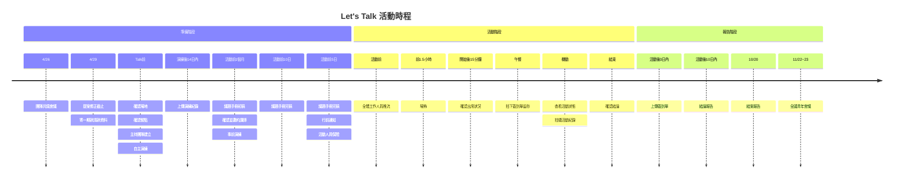

> 審議業師 小工｜2025年編纂

參考往年經驗製作，請以實際狀況為準

## Let's Talk活動時程一覽

---

上面的圖是不是看上去很複雜？那就簡列一些清單給團隊參考～

## 那些要完成的事情

- [x] 團隊共識會議：Apr. 26, 2025
- [ ] 提案修正截止：Apr. 29, 2025，須先經業師確認
- [ ] 繳交一期款請款資料
- [ ] 主持團隊建立（建議）：建議事前演練前
- [ ] 主持團隊名單：事前演練後連同同意書繳交名單
- [ ] 場地確認
- [ ] 講者確認暨邀約
- [ ] 事前演練：Talk前，至少4小時
- [ ] 自主演練 pt. 1：補助至多2場，每場至少4小時
- [ ] 自主演練 pt. 2：補助至多2場，每場至少4小時
- [ ] 繳交演練紀錄：演練後7日內提供給業師回覆意見，14日內上傳網站
- [ ] 議題手冊初稿：（建議）活動前1個月
- [ ] 議題手冊完稿：（建議）活動前10日
- [ ] 議題手冊完稿暨行前通知：（建議）活動前5日
- [ ] 活動人員保險：（建議）活動前5日
- [ ] 活動公共意外責任險
- [ ] 餐點確認：最晚活動前一日
- [ ] 推流：最晚活動前一日
- [ ] Talk辦理：Jun.~Aug., 2025
- [ ] 場佈：活動前一日或當日提前至少1~1.5小時
- [ ] 確認餐點狀況：最晚午餐前45分鐘確認，若有下午茶同理
- [ ] 拍下簽到單：建議中午就可拍下留存
- [ ] 追蹤出席狀況：活動開始後15分鐘
- [ ] 確認討論結論：活動結束後與桌長確認
- [ ] 上傳簽到單：活動後3日內
- [ ] 繳交結論報告：活動後10日內
- [ ] 繳交結案報告：Oct. 20, 2025
- [ ] 寄送自主演練及二期款請款資料：繳交結案報告經審查通過後
- [ ] 全國青年會議：Nov. 22~23, 2025

---

### 撥款二三事補充

!!! warning "重要提醒"
	獎金超過2萬元，會代扣所得稅10％

- 一期款
	- 時間：4/26共識會議後，連同資料寄至指定地點
	- 請款資料：修正後的提案、已簽署的執行切結書及請款文件
		- 民間團體、法人或公司行號：公文、領據（要有：機關章、出納、會計、負責人章）、存摺影本 
		- 青年團隊：獎金分配協定同意書、收據（含身分證影本）、存摺影本
	- 請領獎金總額：70%款項

- 二期款
    - 時間：繳交結案報告，經審核通過後寄送請款文件到指定地點
    - 請領獎金：扣減金額後的獎金總額30%款項。（人數未到或不符規定可能被扣款，詳情請看簡章）

- 自主演練獎金
	- 完成自主演練後，連同2期款請款資料寄至指定地點。 
	- 所需資料
		- 民間團體、法人或公司行號：領據（要有：機關章、出納、會計、負責人章）、存摺影本 
		- 青年團隊：收據（含身分證影本）、存摺影本

- 外找主持人交通費、出席費或出席津貼
	- 所需資料：請款單、匯款帳戶存摺封面影本、去回程交通單據
	- 請領方式：掛號寄回商業周刊編輯顧問股份有限公司；信封備註**114年Talk自主演練相關人員費用請領**
	- 繳交期限：最遲在團隊完成演練後（以郵戳為憑）一次請領相關費用

---

[查看好政網站 :material-search-web:{ .lg .middle }](https://youthhub.yda.gov.tw/){ .md-button }

---
[^1]: 關於專案內容以官方最新公告為準

